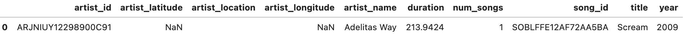
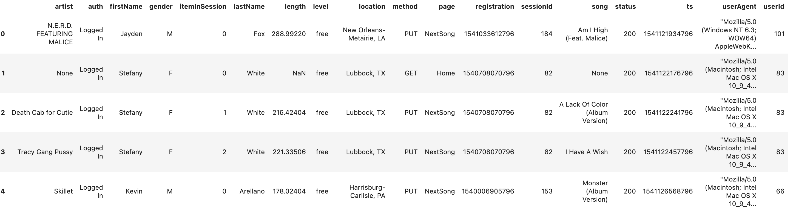
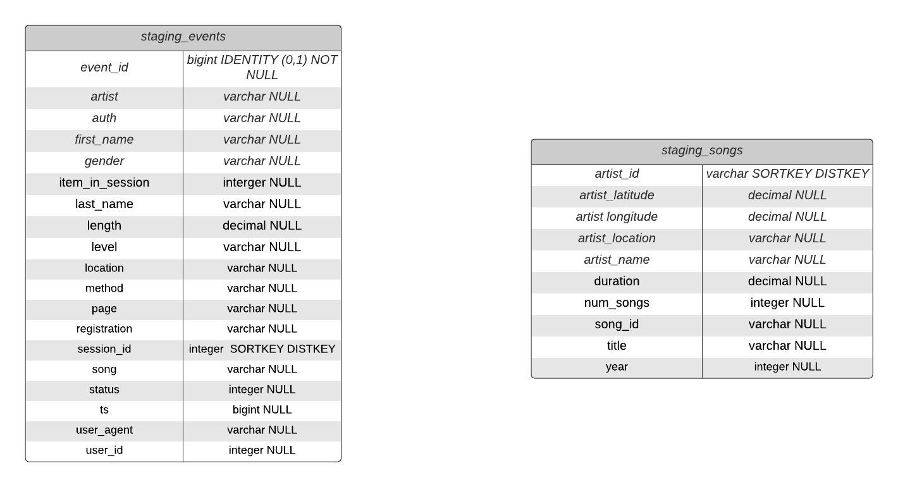
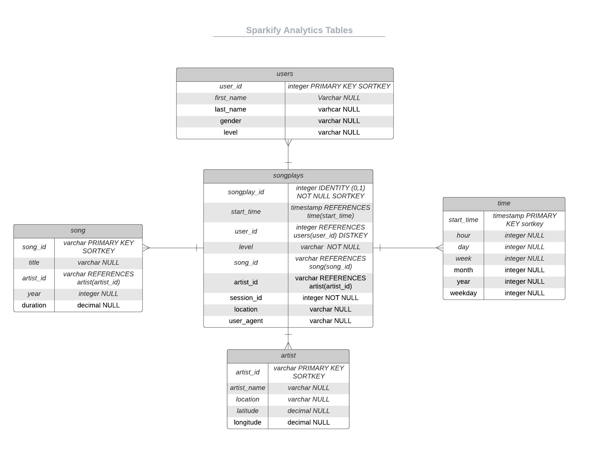

**Project Three: Data Pipeline With Airflow and Redshift**

 

**Overview**

This project builds an ETL pipeline on AWS Cloud for a music streaming service called Sparkify by extracting data from JSON files in S3, staging the data in Redshift, and transforming the data into a set of dimensional tables. This allows the Sparkify analytics team to analyze the song and user data to answer questions like “What day of the week are users listening the most?”

**Technologies used**

*   SQL -
    *   Used for creating, inserting, copying JSON files, and running test queries 
*   Python 
    * Used to Create Airflow Operators and Functions  
*   Redshift
    *   Data Warehouse used to Stage data from S3 and create dimension tables for analytics team
*   S3 
    *   Storage service that holds event and song data JSON files
* Apache Airflow
    * Workflow Managment Tool

**How to Run**

*   AWS 
    *   Create an IAM user 
        *   With permissions to use Redshift
    *   Create IAM role for Redshift with AmazonS3ReadOnlyAccess rights
    *   Create the Redshift cluster
        *   Get the Endpoint ---- also known as Host
*   Airflow
    * Set up Connection for AWS
        * Conn Id: Enter aws_credentials.
        * Conn Type: Enter Amazon Web Services.
        * Login: Enter your Access key ID from the IAM User credentials
        * Password: Enter your Secret access key from the IAM User credentials
     * Set up Redshift Connection
        * Conn Id: Enter redshift.
        * Conn Type: Enter Postgres.
        * Host: Enter the endpoint of your Redshift cluster, excluding the port at the end.
        * Schema: Enter dev. This is the Redshift database you want to connect to.
        * Login: Enter awsuser.
        * Password: Enter the password you created when launching your Redshift cluster.
        * Port: Enter 5439. 

**Information About Dataset**

*   s3://udacity-dend/song_data
    *   31 JSON files
*   **Song_Data Example**

*   s3://udacity-dend/log_data
    *   14897 JSON files
*   **Log_Data Example**

*   Staging_events_table
    *   8056 rows
*   Staging_songs_table
    *   14896 rows
*   User_table
    *   104 Unique Users
*   Song_table
    *   14896 Unique Songs
*   Artist_table
    *   10025 Unique Artist
*   Songplay table
    *   9957 song plays

**Queries Examples from Test_Queries.ipynb**

1. Give me the artist, song title and song's length of the top 15 songs by duration.

*   **Query:** 

		SELECT a.artist_name, s.title, s.duration 
		     
		FROM artist a

		JOIN song s on (a.artist_id = s.artist_id)

		ORDER BY s.duration DESC limit 15;

*   **Query Result Example First Row:** Jean Grae, Chapter One: Destiny, 2709

2. Give me the total number of listens each day of the week ordered in Descending Order.
	
*   **Query:**

		SELECT t.weekday, count(s.songplay_id) as number_of_listens_each_day
	
		FROM time t
	
		JOIN songplay s  on (t.start_time = s.start_time)

		GROUP BY t.weekday
	
		ORDER BY number_of_listens_each_day DESC;

*   **Query Result Example First Row:** 5, 1966
    *   Users listen the most on Saturdays

	

**Database Info and Tables**

*   **Redshift Cluster Info:** 
    *   DWH_CLUSTER_TYPE=multi-node
    *   DWH_NUM_NODES=4
    *   DWH_NODE_TYPE=dc2.large

